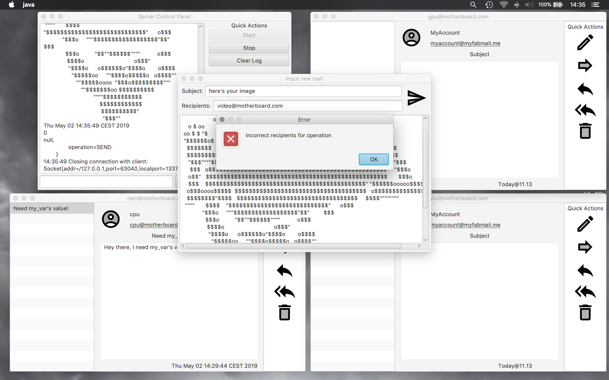

# Mails
2018/2019 Java programming 3 university project.  Some of the course topics were:

* Java Generics
* Threads, Tasks, Threadpools
* Graphics(swing + javafx)
* Observable/Observer
* Interfaces and polymorphism

# Screenshots





# License
```
Copyright (C) 2022 Luca D'Amato

This program is free software: you can redistribute it and/or modify
it under the terms of the GNU General Public License as published by
the Free Software Foundation, either version 3 of the License, or
(at your option) any later version.

This program is distributed in the hope that it will be useful,
but WITHOUT ANY WARRANTY; without even the implied warranty of
MERCHANTABILITY or FITNESS FOR A PARTICULAR PURPOSE.  See the
GNU General Public License for more details.

You should have received a copy of the GNU General Public License
along with this program.  If not, see <https://www.gnu.org/licenses/>.
```
